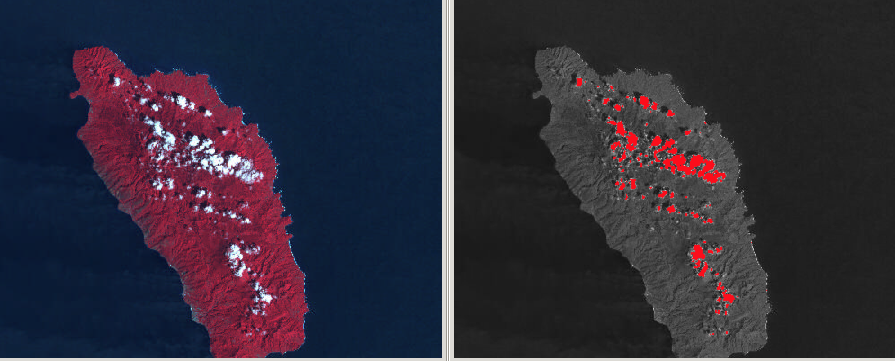
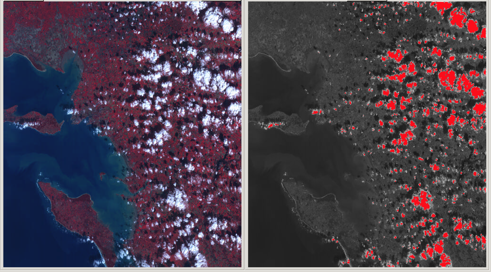

# Cloud detection with custom k-means

Implementation in C of the paper
[Introducing spatial information in k-means algorithm for clouds detection in optical satellite images](http://adsabs.harvard.edu/abs/2001SPIE.4168...67B).

A copy of the pdf is included at the root of the repo.

## The algorithm

In a few words, we need a way to compute the % of clouds in an photo taken from space.

The algorithm creates blob of pixels (central, up, right, down, left) and applies
a k-medians on it.

The k-medians is like a k-means but uses a median operation instead of a mean
operation. Furthermore the distance metric used is a Manhattan distance.

The pixels belongings to the highest k-medians' center (thus having pixels with
high values -> whiter) are considered as clouds.

## Results

Percent of clouds: 1.19 %

Percent of clouds: 5.28 %
